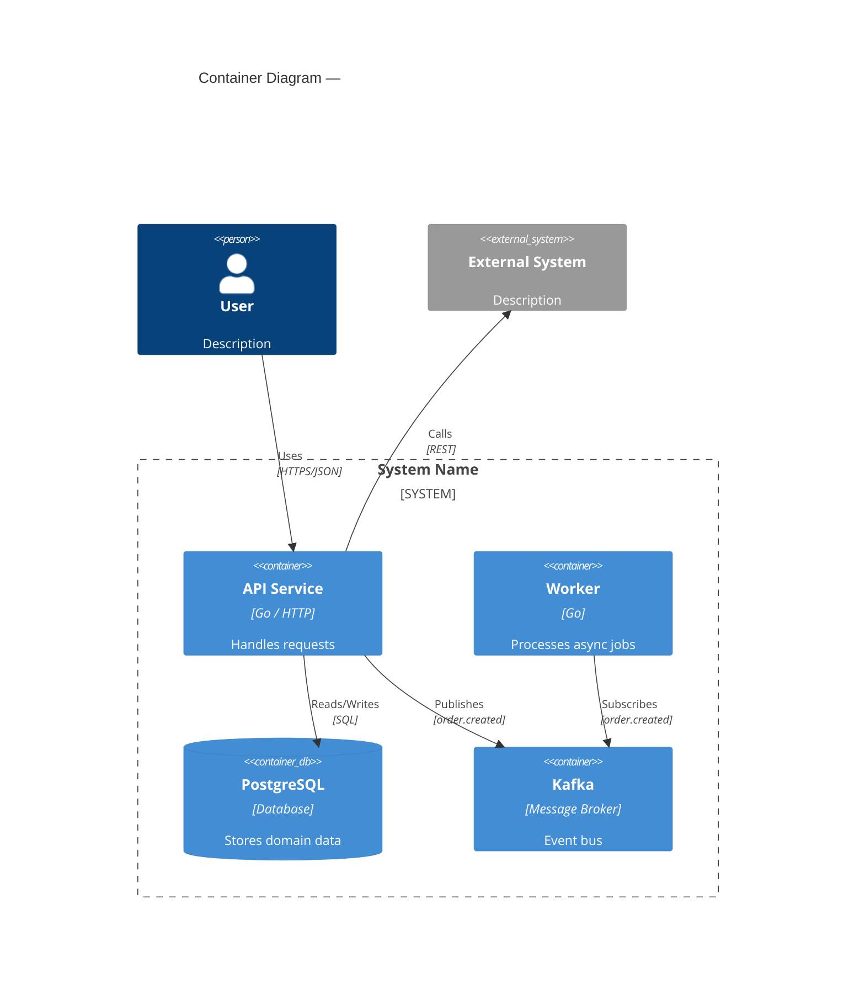

# Software Architecture Skill

> **STOP — load this dependency before reading further.**
>
> Invoke the Skill tool now: `Skill(skill: "base-guidelines")`
> Do not read past this line until the skill has been loaded.
> Then return here and continue with the next section.

---

## Scope of This Skill

This skill covers **what to build and how to structure it** — not how to implement it.

| In scope | Out of scope |
|---|---|
| Architectural pattern selection | Code generation |
| Bounded context mapping | Implementation details |
| Inter-service contracts & communication | Testing strategy |
| C4 diagrams & system diagrams | PR review |
| ADR authoring | Refactoring |
| Tech stack decisions | Language-specific idioms |
| Scalability & reliability trade-offs | |

---

## Input Resolution

This skill follows **feature-spec** and **user-stories** in the workflow. Before beginning the architecture decision process:

1. **Look for preceding outputs** — Check if the following documents exist and load all that are found:
   - `docs/feature/<slug>/feature-spec.md` (from feature-spec skill)
   - `docs/feature/<slug>/user-stories.md` (from user-stories skill)
   - `docs/architecture/tech_debt.md` — existing accepted risks and attention points (see Step 5). Load this regardless of whether feature docs exist.
2. **Fall back to user prompt** — If no documents exist but the user described a system or feature, use that description to begin Step 1 of the decision process.
3. **If no input available** — Ask: *"What system or feature are you designing? Share the feature spec or describe the problem you need to architect."*

---

## 1. Architecture Decision Process

Architecture is a **collaborative, iterative conversation** with the user — not a solo design exercise.

### The Golden Rules
- **Never propose an architecture without first understanding the domain.** Ask; don't assume.
- **Never make a significant decision without explicit user consent.** Present options with trade-offs; let the user choose.
- **Surface problems and conflicts as soon as they are found.** Don't silently resolve tensions — bring them to the user.
- **One step at a time.** Complete each step, present findings, and wait for user confirmation before moving forward.
- **Assumptions must be stated explicitly.** If you must proceed with incomplete information, declare the assumption, explain its impact, and flag it for validation.

---

### Step 1 — Discover the Problem
Open a dialogue. Ask targeted questions — never all at once. One theme per exchange:

**Domain questions** (ask first):
- What is the core business problem this system solves?
- Who are the users and what are the key workflows?
- What are the most important domain concepts and operations?

**Scale & constraint questions** (ask after domain is understood):
- What is the expected load / data volume / number of users?
- What is the team size and structure?
- Are there existing systems, integrations, or compliance requirements to consider?

**Quality attribute questions** (ask last — these make no sense without context):
- What matters most: latency, consistency, availability, or developer velocity?
- What does failure look like — what is the worst outcome if the system goes down?

> **Do not proceed to Step 2 until the user has confirmed the problem is correctly understood.**
> Summarise your understanding and ask: *"Does this accurately capture what you're trying to build?"*

---

### Step 2 — Map Bounded Contexts
Propose a context map based on what you've learned. For each context:
- Name it using the **ubiquitous language** of that domain area.
- Classify it: **Core Domain** (highest value), **Supporting**, or **Generic** (consider buying).
- Describe what it owns and what it does not.

Present the proposed map to the user. Explicitly ask:
- *"Does this breakdown match how your organisation thinks about the domain?"*
- *"Is there a context here that should be merged or split?"*
- *"Are there areas of the domain we haven't covered?"*

> **Do not proceed to Step 3 until the context map is validated by the user.**

---

### Step 3 — Propose an Architectural Style
Using the pattern guide in Section 2, propose **one primary style** with a clear rationale tied to the user's specific constraints and quality attributes. Do not present a menu of patterns — make a recommendation.

Structure your proposal as:
1. **Recommended pattern** and why it fits *this specific problem*.
2. **What it trades off** — be honest about the downsides.
3. **The next-best alternative** and why you didn't choose it.
4. **Open questions** — list any unknowns that could change the recommendation.

Ask explicitly: *"Do you agree with this direction, or would you like to explore the alternative?"*

> **Do not proceed to Step 4 until the user has accepted the architectural style.**

---

### Step 4 — Define Contracts at Boundaries
For each boundary identified in the context map, propose:
- Communication style (sync or async) — use the guide in Section 6.
- Contract format (REST, gRPC, event schema).
- Ownership and versioning strategy.

Present each boundary decision separately if they differ. For each one, flag any **tensions or risks** you spot (e.g. "this boundary requires a distributed transaction — here are the options").

Ask: *"Are you comfortable with these communication patterns, or do you have constraints I should know about?"*

> **Do not proceed to Step 5 until contracts are confirmed.**

---

### Step 5 — Identify and Escalate Problems
Before producing any documentation, run the **Scalability & Reliability Checklist** (Section 7) against the agreed design. For every item that fails or is uncertain:
- State the problem clearly.
- Explain the risk and its severity.
- Propose one or more options to address it.
- Ask the user which option to take — or whether to accept the risk.

Never silently fix a problem by adding complexity. Always surface it.

**Cross-check against `docs/architecture/tech_debt.md`** (loaded in Input Resolution): if the new design touches a seam, module, or constraint described in an existing entry, surface it explicitly — e.g. *"This new path reads `member.skill` directly, which is the second-path risk flagged in tech_debt.md's 'Single seam for member-stat reads' entry. Route it through `effectiveRoster()` instead, or accept the drift?"* Treat resolved entries as closed: propose removing them from `tech_debt.md` in Step 6.

When the user **accepts a risk** or the design contains a deliberate constraint/workaround that future developers could silently break, log it in `docs/architecture/tech_debt.md` (create if absent). Each entry: what it is, why it matters, and what to watch for. This is a living register — lower ceremony than an ADR, but important enough to persist. Surfaced during the Signature Loot session as the right tool for "attention points" that don't rise to decision level.

---

### Step 6 — Document
Only after all prior steps are confirmed, produce:
- One **Architecture Document** using `references/template-architecture.md`.
- One **ADR** per significant decision using `references/template-adr.md`.
- A **C4 diagram** embedded in the architecture document (see Section 4).
- **`docs/architecture/tech_debt.md`** — append new attention points logged in Step 5, and remove entries resolved by this design (skip the file entirely if nothing changed).

Fill the `ai_context` YAML block of each document incrementally — update it as each
step of the process is completed, not all at once at the end.

Present drafts to the user before treating them as final. Ask: *"Does this accurately reflect the decisions we made?"*

---

### Step 7 — Commit

Load the `git` skill and commit the files written in Step 6:

```bash
git add <architecture doc, ADRs, C4 diagram, tech_debt.md — only files from this step>
git commit -m "archi(<slug>): message"
```

Verify clean state with `git status` after committing.

---

### Step 8 — Task Execution Loop

After the architecture document is committed, enter the task loop. **Do not skip this step.**

**One story at a time. Never batch.**

1. **Read the story list** — Open `docs/feature/<slug>/user-stories.md`. Extract every story and present the numbered queue to the user. Ask: *"Which story should we start with? (default: story #1)"*

2. **For each story** (in order, waiting for explicit confirmation before moving to the next):

   **a. Scope the architecture to this story**
   - Identify which bounded contexts, components, and layers this story touches.
   - List any story-specific constraints or edge cases not covered by the global architecture.
   - State which ADR decisions are directly relevant.
   - Present this scoped view to the user: *"For story [N], we touch [X, Y, Z]. Any corrections?"*

   **b. Invoke tech-breakdown for this story**
   - Load the `tech-breakdown` skill.
   - Pass it: (1) the scoped architecture from step 2a, (2) this story's text and acceptance criteria.
   - The tech-breakdown produces dev tasks for this story only — not the full feature.
   - Write output to `docs/feature/<slug>/tech-breakdown-<story-id>.md`.

   **c. Hand off to software-development**
   - Present the tech-breakdown output.
   - Say explicitly: *"Ready for software-development on story [N]. Load `software-development` and implement task by task."*
   - During tasks, run only affected tests. After the final task, run story finalization once: full tests, quality gates, then one authorized story commit.
   - Wait. Do not continue to the next story until the user confirms this story's implementation is done.

   **d. Confirm and advance**
   - After user confirms: *"Story [N] done. Moving to story [N+1]: [title]. Shall we proceed?"*
   - Only proceed on confirmation.

3. **When all stories are done** — Produce a final summary: which stories were implemented, which ADRs were used, any open architectural questions that surfaced during implementation.

> **Hard rules for this loop:**
> - Never process two stories simultaneously.
> - Never skip the tech-breakdown step — it is mandatory between architecture and development.
> - Never assume the previous story's implementation is complete — wait for explicit user confirmation.
> - If a story reveals a gap in the global architecture, pause the loop, resolve the gap (update the architecture doc and ADR), commit, then resume.

---

### Iteration
At any point the user may revisit a prior step. When they do:
- Acknowledge which decision is being re-opened.
- Re-evaluate all downstream decisions that depend on it.
- List which previously agreed items may need to change as a consequence.
- Walk through the affected steps again with the user.

---

## 2. Architectural Pattern Selection Guide

### Monolith First
**Default starting point** unless there is a concrete reason to distribute.
- Use a **Modular Monolith** when: team < 10 engineers, domain not yet well understood, or speed of iteration is the top priority.
- Modules map 1:1 to bounded contexts; inter-module calls go through defined interfaces, never direct package access across context boundaries.
- This makes future extraction to services mechanical, not a rewrite.

### When to Distribute (Microservices / SOA)
Only distribute when at least one of these is true:
- Independent deployment frequency: teams need to release at different cadences.
- Independent scaling: one context has dramatically different load characteristics.
- Technology isolation: a context genuinely benefits from a different runtime or data store.
- Team autonomy: Conway's Law — the architecture should mirror the team structure.

**Never distribute prematurely.** The cost is real: network latency, distributed transactions, operational complexity, and observability overhead.

### Pattern Reference

| Pattern | Use when | Key trade-off |
|---|---|---|
| **Modular Monolith** | Default; early-stage; small team | Simple ops; harder to scale individual parts |
| **Microservices** | Large teams; independent scaling needs; clear domain boundaries | Operational complexity; distributed systems problems |
| **Event-Driven** | High decoupling needed; async workflows; audit/replay requirements | Eventual consistency; harder to reason about flow |
| **CQRS** | Read/write load is asymmetric; complex query requirements | Two models to maintain; added complexity |
| **Event Sourcing** | Full audit trail required; temporal queries; undo/replay | Storage growth; query complexity; steep learning curve |
| **Hexagonal (Ports & Adapters)** | Want to keep domain fully isolated from infra/transport | More boilerplate; indirection can obscure flow |
| **Saga** | Distributed transactions across services | Complexity; compensating transactions are hard |

> Apply KISS: choose the simplest pattern that satisfies the actual requirements. Patterns can be combined (e.g. CQRS inside an event-driven microservice), but each addition must be justified.

### Default Persistence & Port Placement

Unless the user opts out, apply these defaults whenever the design has a persistent domain:

1. **Repository interfaces live in the domain layer.** The repository is a domain
   concept (the "collection of aggregates" in the ubiquitous language), so its
   interface is declared with the aggregate in the domain — named in domain language,
   not storage terms. Infrastructure implements it; application/use-case services
   consume it. This is the DDD placement, chosen deliberately over Go's
   "interface-with-the-consumer" convention so the persistence contract stays part of
   the domain and remains reachable by future domain services.
   - Trade-off to police: domain repositories tend to bloat with finders and tempt
     infra leakage (cursors, tx handles, SQL-shaped filters). Keep them to
     aggregate **load/save** plus a small set of domain-meaningful lookups; push
     everything query-shaped to the read side below.

2. **Separate the read model from the write model (CQRS-lite by default).**
   - **Write side** — one canonical *aggregate repository* per aggregate, in the
     domain, dealing only in whole aggregates (load/save). It protects invariants.
   - **Read side** — *query services* that return DTOs / read models, never
     aggregates. They own filtering, sorting, pagination, and projections, and live
     in the application (or a dedicated read package), free to query storage directly.
   - Never route list/search/detail screens through the aggregate repository, and
     never reshape an aggregate repository to serve a UI query.

3. **The application service owns *when* to persist; aggregates never persist
   themselves.** Persistence timing and transaction/unit-of-work scope are
   application concerns (they can span multiple aggregates). Aggregates guarantee
   they are consistent *whenever* saved; they hold no repository reference. This is
   DDD/Persistence Ignorance — explicitly not Active Record. Note this is orthogonal
   to rule 1: declaring the port in the domain does not make the aggregate call it.

> Escape hatch: for a genuinely CRUD-shaped, logic-thin context, Active Record or a
> single app-side repository may be the lazier correct choice — but call it out and
> get user consent, since it trades the pure model away.

---

## 3. Bounded Context Mapping

### Context Relationships

| Relationship | Description | When to use |
|---|---|---|
| **Partnership** | Two contexts evolve together; teams coordinate | Tightly coupled teams with shared goals |
| **Shared Kernel** | Small shared model both contexts agree not to change unilaterally | Minimize duplication when contexts overlap on core concepts |
| **Customer/Supplier** | Upstream (supplier) provides API; downstream (customer) conforms | Clear ownership; upstream sets the contract |
| **Conformist** | Downstream adopts upstream model wholesale | When upstream is an external system you can't negotiate with |
| **Anti-Corruption Layer (ACL)** | Downstream translates upstream model into its own | Protecting your domain from a legacy or external model |
| **Open Host Service** | Upstream publishes a formal, versioned protocol | Upstream serves many consumers |
| **Published Language** | Shared, well-documented interchange format (e.g. JSON Schema, Protobuf) | Cross-team or cross-system integration |

### Context Map Template
When producing a context map, always show:
1. Each bounded context as a named box.
2. The relationship type on each connection.
3. Which side is upstream (U) and downstream (D).
4. ACLs explicitly marked where they exist.

---

## 4. C4 Diagrams

Produce diagrams at the appropriate level for the audience. Use text-based notation (Mermaid or PlantUML) so diagrams live in version control.

### Level 1 — System Context
Shows the system under design, its users, and the external systems it interacts with.
```
Who uses it? What does it depend on?
```

### Level 2 — Container
Shows the deployable units (services, databases, message brokers, frontends) inside the system.
```
What runs? How do containers communicate?
```

### Level 3 — Component
Shows the major components (bounded context modules, use case handlers) inside one container.
```
How is the container structured internally?
```

### Level 4 — Code
Shows classes/types within a component. Use sparingly — only when explaining a non-obvious design.

### Diagram Rules
- Every diagram must have a **title** and a **legend**.
- Every arrow must have a **label** describing what flows (e.g. "HTTP/JSON", "gRPC", "Kafka topic: order.created").
- Include technology choices on containers and connections.
- Keep each diagram focused on one level; do not mix levels.

### Mermaid Template (Container Level)


---

## 5. Output Documents

Every architecture session produces two types of document. Both live in the Git repo.
Both contain a machine-readable `ai_context` YAML block at the top so AI consumers
(e.g. the developer skill) can extract constraints and decisions without parsing prose.

### Document 1 — Architecture Document (one per need)

**Location**: `docs/feature/<slug>/architecture.md`

One document per need — not per conversation. A need can come from a product requirement,
a technical constraint, a bug, or an incident. The slug is always:
- the ticket ID if one exists (`PROJ-123`, `ENG-42`), or
- a short, lowercase, hyphenated description of the need if no ticket exists (`order-splitting-support`, `replace-legacy-auth`).

The document captures:
- The AI context block: the need, domain, constraints, quality priorities, all decisions, open questions, assumptions.
- The bounded context map.
- A summary table of every decision made, each linking to its ADR.
- The **Thinking Process** narrative: what was explored, what changed, what remains open.
- The system diagram (C4 Mermaid).

**Template**: `references/template-architecture.md` — copy and fill in during the session.
Update the `ai_context` block incrementally as each step of the decision process is completed.

If the same need requires multiple architecture conversations over time, **update the existing document** and supersede ADRs rather than creating a new document.

---

### Document 2 — Architecture Decision Record (one per significant decision)

**Location**: `docs/adr/ADR-<NNN>-<slug>.md`

One ADR per decision. "Significant" means: hard to reverse, affects multiple teams,
or involves a non-obvious trade-off.

Each ADR contains:
- The AI context block: what was chosen, what was rejected and why, what the implementation layer must and must not do (`must_not`).
- Full alternatives comparison with explicit rejection rationale.
- A **Thinking Process** section retracing how the decision was reached.
- **Implementation Constraints**: DO / DO NOT rules derived directly from the decision, written for the developer (human or AI).

**Template**: `references/template-adr.md` — copy and fill in for each decision.

---

### ADR Rules
- One ADR per decision. Do not bundle multiple decisions in one record.
- Keep ADRs immutable after acceptance — never edit history. Supersede instead.
- Number sequentially: `ADR-001`, `ADR-002`, …
- Every ADR must link back to its parent architecture document.
- The Architecture document's `related_adrs` list must be kept in sync.

---

### Repo Layout

```
docs/
├── feature/
│   ├── PROJ-123/
│   │   └── architecture.md          ← need with a ticket ID
│   ├── ENG-42/
│   │   └── architecture.md
│   └── replace-legacy-auth/
│       └── architecture.md          ← need without a ticket ID
└── adr/
    ├── ADR-001-<slug>.md
    ├── ADR-002-<slug>.md
    └── …
```

---

## 6. Inter-Service Communication

### Synchronous (Request/Response)
- Use for: queries that need an immediate answer, user-facing operations where latency matters.
- Prefer **gRPC** for internal service-to-service calls (strongly typed, efficient).
- Use **REST/JSON** for public APIs or when clients are external.
- Always define a timeout; never wait indefinitely.
- Apply the **Circuit Breaker** pattern for calls to external or unreliable services.

### Asynchronous (Events / Messages)
- Use for: decoupling producers from consumers, workflows that can tolerate eventual consistency, fan-out to multiple consumers.
- Events are **facts**: named in past tense, immutable (`OrderPlaced`, `PaymentFailed`).
- Commands are **intentions**: named as imperatives (`PlaceOrder`, `RefundPayment`) — sent to a specific receiver.
- Each event schema must be versioned; use **backward-compatible evolution** (add fields, never remove).
- Document every event on a shared **Event Catalog**.

### Choosing Sync vs Async

| Signal | Prefer |
|---|---|
| User is waiting for the result | Sync |
| Multiple consumers need the same data | Async |
| Workflow spans multiple services | Async (Saga) |
| Operation is idempotent and retriable | Async |
| Strong consistency is required | Sync (or avoid distribution) |

---

## 7. Scalability & Reliability Checklist

Before finalising an architecture, verify:

**Scalability**
- [ ] Which components are on the critical path for latency?
- [ ] Where are the bottlenecks? (DB, external API, CPU-bound computation?)
- [ ] Can stateless services scale horizontally without coordination?
- [ ] Is caching applied at the right layer (CDN, in-process, distributed)?

**Reliability**
- [ ] What happens if each external dependency is unavailable?
- [ ] Are there single points of failure? If so, are they acceptable?
- [ ] Is there a retry strategy with exponential backoff and jitter?
- [ ] Are idempotency keys used for operations that must not execute twice?
- [ ] Is there a dead-letter queue for failed async messages?

**Observability**
- [ ] Are structured logs emitted at service boundaries?
- [ ] Is distributed tracing propagated across service calls?
- [ ] Are key business metrics (not just technical ones) instrumented?
- [ ] Is there a runbook for every alertable failure mode?

**Security**
- [ ] Is authentication enforced at the entry point, not scattered across services?
- [ ] Is inter-service communication authenticated (mTLS, service accounts)?
- [ ] Is sensitive data identified and treated accordingly at the architecture level?

---

## 8. What This Skill Does NOT Cover

| Concern | Covered by |
|---|---|
| Implementation code | `software-development` |
| Language-specific idioms | `software-development` |
| Testing strategy & PR review | `software-development` |
| Refactoring patterns | `software-development` |
| DDD building blocks & clean code rules | `base-guidelines` |
| Go project structure | `base-guidelines` |
