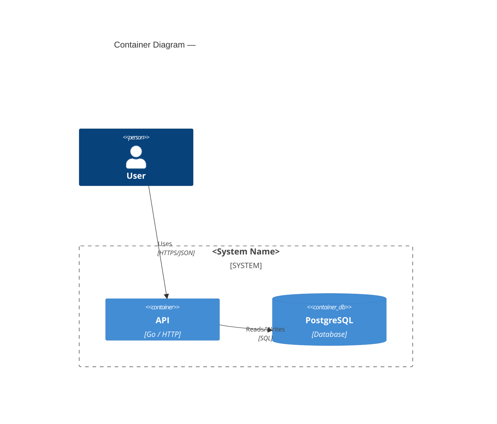

# Architecture: <Ticket ID or short need description>

> **File**: `docs/architecture/<ticket-id-or-short-slug>.md`
> **Ticket / Need**: `<PROJ-123>` or `<short description if no ticket exists>`
> **Status**: `draft` | `in-review` | `approved` | `superseded`
> **Superseded by**: *(link if applicable)*

---

## 1. Need

*1–3 paragraphs. Explain the need this architecture addresses — business, technical, or both.
Why does it need to be solved now? What is the cost of not solving it?
Write for a reader who has no prior context. No jargon.*

---

## 2. Goals & Non-Goals

### Goals
*What this architecture must achieve in response to the need. Each goal should be specific and verifiable.*

- [ ] Goal 1
- [ ] Goal 2

### Non-Goals
*What is explicitly out of scope. Prevents scope creep and signals what a future architecture doc should cover.*

- Non-goal 1

---

## 3. Domain Map

*Briefly describe each bounded context. Use the ubiquitous language established with the user.*

| Context | Classification | Owns | Does NOT own |
|---|---|---|---|
| ContextA | Core / Supporting / Generic | … | … |
| ContextB | Core / Supporting / Generic | … | … |

### Context Relationships
*Describe how contexts relate. Reference Section 3 of the architecture skill for relationship types.*

- `ContextA → ContextB`: Customer/Supplier — A depends on B's published API.
- `ContextA ↔ ContextC`: Anti-Corruption Layer — A translates C's legacy model.

---

## 4. Architectural Decisions Summary

*One row per significant decision. Each row links to a full ADR.*

| # | Decision | Chosen Option | Rationale (one line) | ADR |
|---|---|---|---|---|
| 1 | Architectural style | Modular Monolith | Team < 10; domain not yet stable | [ADR-001](../adr/ADR-001.md) |
| 2 | Inter-service comms | gRPC (internal) / REST (external) | Type safety internally; broad compatibility externally | [ADR-002](../adr/ADR-002.md) |

---

## 5. Thinking Process

*This section retraces how the architecture arrived at its decisions. It is the human-readable
companion to the `ai_context.decisions` block. Write it as a narrative — not bullet points.*

### What we started with
*Summarise the need as it was originally understood, and the constraints brought into the discussion.*

### What we explored
*For each significant fork in the reasoning, explain: what options were on the table,
what tensions or trade-offs were surfaced, and what questions were asked.*

**Topic: <e.g. "Whether to distribute services">**
We considered X and Y. The main tension was between Z (favoured by constraint A) and W
(favoured by quality attribute B). The need required B as a priority, which led
to rejecting Y because…

*(Repeat for each major topic)*

### What changed during the process
*List any decisions that were revised, why they changed, and what the revision
means for downstream decisions.*

- **Revision**: We initially proposed X but changed to Y after clarifying Z.
  Impact: ADR-002 now depends on Y rather than X.

### What remains open
*Reference the `open_questions` in the AI context block. Explain why each question is
unresolved and what needs to happen before it can be closed.*

---

## 6. System Diagram

*C4 Container or Component diagram. Use Mermaid so it renders in GitHub.*

---

## 7. Open Questions

*Expanded view of the `open_questions` in the AI context block.*

| ID | Question | Impact if unresolved | Owner | Due |
|---|---|---|---|---|
| OQ-1 | | | | |

---

## 8. Assumptions

*Expanded view of the `assumptions` in the AI context block.*

| ID | Assumption | Consequence if wrong | Validated? |
|---|---|---|---|
| A-1 | | | ☐ |

---

## 9. Follow-up Actions

- [ ] `[owner]` Action description — *due: YYYY-MM-DD*
