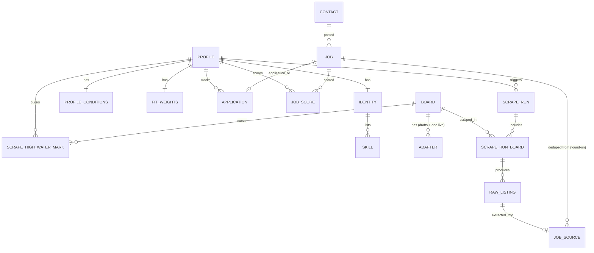

# Data Model

Datastore: **PostgreSQL** (Cloud SQL deployed, Postgres container for local dev). Raw
HTML/JSON lives in **GCS**, referenced by path from `raw_listing`. See
[ADR-002](../adr/ADR-002-postgres-and-gcs-datastore.md).

## Entity-relationship overview

## Tables by context

### Profiles
- **profile** — a search persona. `id`, `name`, `search_keywords`, `location`,
  `is_active` (exactly one true at a time).
- **identity** — LinkedIn-imported snapshot (1:1). `profile_id`, `seniority`,
  `raw_experience`.
- **skill** — flat identity skill list, no self-rating. `identity_id`, `name`.
- **profile_conditions** — dealbreakers + preferences. Dealbreakers: `contract_type`,
  `remote_policy`, `min_salary`, `required_skills[]`. Preferences: `preferred_skills[]`,
  `max_office_days`, `location_pref`, `working_days`.
- **fit_weights** — per-profile scoring weights (preferred-skills %, salary %, location %,
  office-days %, working-days %) as JSON; soft components sum to 100%.

### Boards
- **board** — a job board source. `id`, `name`, `base_url`, `enabled`.
- **adapter** — scraping spec for a board (drafts + one live). `board_id`, `status`
  (draft/approved), `fetch_mode` (json_api/html), `spec` JSON (url_template, param_map,
  pagination, result fields, incremental config — see [pipeline.md](pipeline.md)),
  `version`.
- **schedule** — single row; the one global cron expression applied to Cloud Scheduler.

### Scraping
- **scrape_run** — one pipeline execution. `id`, `profile_id`, `trigger`
  (on_demand/scheduled), `status`, timestamps.
- **scrape_run_board** — per-board progress within a run. `run_id`, `board_id`, `status`,
  counts, `error`.
- **raw_listing** — one captured listing, stored verbatim. `id`, `run_board_id`,
  `board_id`, `source_url`, `title`, `company`, `location`, `raw_ref` (GCS path),
  `posted_at`, `content_hash` (idempotency/dedup), `extraction_status`. `title`/`company`/
  `location` are captured verbatim off the search card (not LLM-extracted).
- **scrape_high_water_mark** — incremental cursor per `(board_id, profile_id)`.
  `cursor_posted_at` (most recent `posted_at` seen last run), `updated_at`. Drives the
  `posted_at`-based incremental stop condition. PK `(board_id, profile_id)`.

### Jobs
- **job** — deduped structured listing (aggregate root). Identity fields (card-captured
  verbatim, not extracted): `title`, `company`, `location`, `url`. Structured fields:
  `skills[]`, `remote_policy`, `office_days`, `contract_type`, `working_days`,
  `salary_min/max`, `seniority`. Plus `field_confidence` (JSON, per-field 0–100),
  `understanding_score` (0–100), `fingerprint` (cross-board dedup key, deterministic over
  the identity fields), `contact_id`, `first_seen`, `last_seen`, `expired_at`.
- **job_source** — the "found on: WTTJ, Indeed" links. `job_id`, `raw_listing_id`,
  `board_id` (many sources → one job).
- **job_score** — fit score per `(job_id, profile_id)`. `passes_dealbreakers` (bool gate),
  `weighted_score`, `component_breakdown` (JSON).
- **application** — kanban status per `(profile_id, job_id)`. `status`
  (Saved/Applied/Interview/Offer/Rejected), `updated_at`.

### Contacts
- **contact** — recruiter record, auto-populated + dedup. `id`, `name`, `company`,
  `email`, `linkedin_url`, `phone`, `notes`, `tags[]`, `dedup_key` (email|linkedin).
  Linked from `job.contact_id`.

## Notes

- **No `job_queue` table** — the queue is Pub/Sub, not a DB table.
- **Dedup**: raw listings deduped within a run by `content_hash`; jobs deduped across
  boards by `fingerprint` (normalized title+company+location+salary), merging into one
  `job` with multiple `job_source` rows; contacts deduped by email or LinkedIn URL.
- **Multi-user boundary**: every scoped table (`profile`, `job`, `job_score`,
  `application`, `contact`, `scrape_*`) gains a `tenant_id` column — additive, no rewrite.
