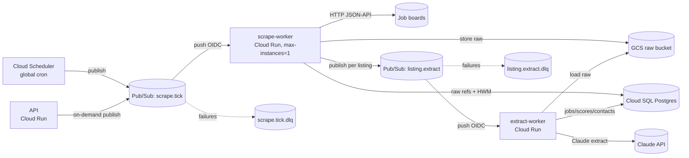

# Deployment

Scheduled pipeline work runs as **separate worker binaries** on GCP, triggered by Cloud
Scheduler — not as goroutines inside the API process. Region: **europe-west9 (Paris)**.
See [ADR-003](../adr/ADR-003-cloud-scheduled-worker-binaries.md) and
[infrastructure.md](infrastructure.md) for the OpenTofu layer.

## 1. Topology



**Shape: Cloud Scheduler → Pub/Sub → Cloud Run (push, OIDC).** Pub/Sub is the queue
(at-least-once, retries, DLQ, message-id idempotency); Cloud Run scales to zero (≈$0 idle
for one user) and autoscales for multi-tenant fan-out without code change. Rejected: Cloud
Run Jobs (weak for per-listing fan-out / per-message retry); Cloud Tasks for the trigger
(but earmarked for per-board rate limiting at scale — see §4).

## 2. Compute units

| Unit | Trigger | CPU / Mem | Concurrency | Scaling |
|---|---|---|---|---|
| `api` (Cloud Run) | HTTPS from SPA | 1 vCPU / 512 MB | ~80 | min 0 |
| `scrape-worker` (Cloud Run) | Pub/Sub push `scrape.tick` | 1 vCPU / 512 MB | 1 | min 0, **max-instances=1** |
| `extract-worker` (Cloud Run) | Pub/Sub push `listing.extract` | 1 vCPU / 512 MB–1 GB | 4–8 | min 0, max ~5 |
| Cloud SQL Postgres | — | small tier (e.g. db-g1-small) | — | always-on (only constant cost) |

Pub/Sub, Cloud Scheduler, GCS, Secret Manager are serverless. The SPA is static assets
(GCS+CDN or Firebase Hosting), no server compute.

## 3. cmd/ layout — shared domain, thin mains

```
cmd/
  api/main.go             # Cloud Run service: chi REST API + Pub/Sub publisher
  scrape-worker/main.go   # Cloud Run service: Pub/Sub push handler for scrape.tick
  extract-worker/main.go  # Cloud Run service: Pub/Sub push handler for listing.extract
internal/                 # ALL shared — imported by every bin, never forked
```

Each `main` wires only what its binary needs:
- `cmd/api`: Postgres pool + all read/write app-services + `messaging.Publisher` + chi router.
- `cmd/scrape-worker`: Postgres pool + `scraping` app-service + `boards`/`profiles` readers
  + GCS writer + `messaging.Publisher` + a tiny HTTP server whose one route handles the
  `scrape.tick` push.
- `cmd/extract-worker`: Postgres pool + `extraction`+`scoring` app-services + GCS reader +
  `llm` Claude client + a tiny HTTP server handling the `listing.extract` push.

No domain logic in `main`; no forked packages. A future `cmd/headless-scrape-worker` or
`cmd/score-worker` is a new thin main + topic, not a refactor.

## 4. Rate limiting across processes

- **Today (single user)**: pin `scrape-worker` to `max-instances=1`, `concurrency=1` → the
  in-process per-board `x/time/rate` limiter remains authoritative. Zero extra infra.
- **Multi-tenant**: a board's rate limit belongs to the **board**, shared across tenants, so
  it must be coordinated globally once scraping scales out → move per-board dispatch to
  **Cloud Tasks** (one queue per board, `maxDispatchesPerSecond`). Config/wiring change
  behind the same `scraping` app-service, not a domain rewrite.

## 5. Single-user → multi-user evolution

| Concern | Single user (today) | Multi-tenant (later) | Rewrite? |
|---|---|---|---|
| Datastore | Cloud SQL Postgres | + `tenant_id` on scoped tables + row scoping | No |
| Auth | none (private Cloud Run / IAP) | Identity Platform / Firebase Auth at the API | No |
| Scheduled runs | one `scrape.tick`, active profile | fan out per active profile per tenant | No |
| Rate limiting | in-process limiter, 1 instance | Cloud Tasks per-board queue | No |
| Scrape concurrency | `max-instances=1` | lifted once limiter externalized | No |

The seam is clean because contexts already take active-profile (later + tenant) as an
explicit parameter, the queue is already Pub/Sub, the DB is already networked Postgres, and
rate limiting is already behind the `scraping` app-service.
