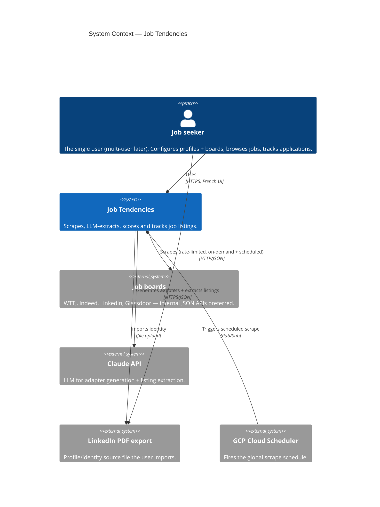
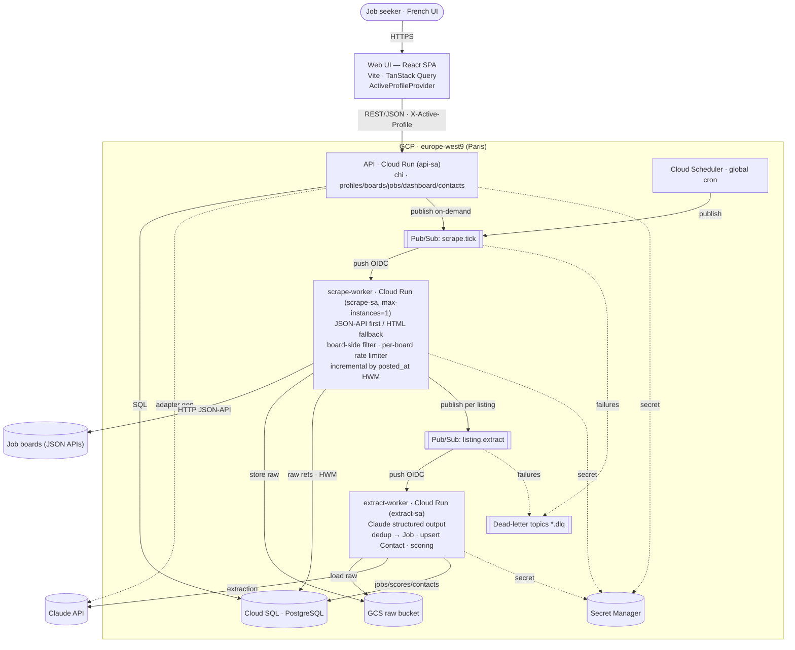
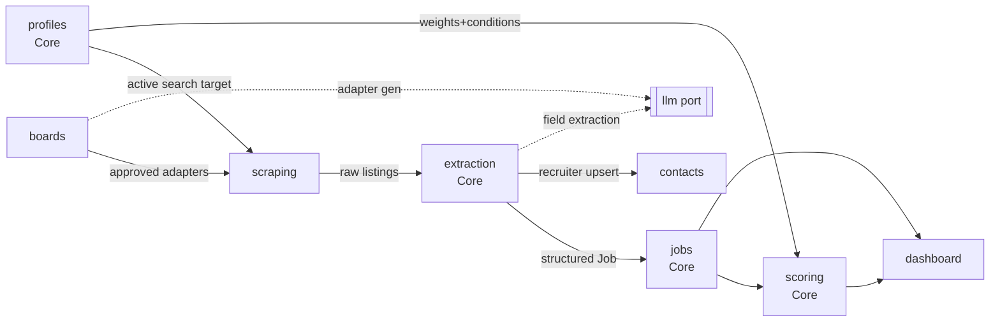

---
ai_context:
  need: "System architecture for Job Tendencies — a single-user job intelligence tool"
  domain: "Job search / market intelligence"
  constraints:
    - "Single user today; NOT excluded from going public/multi-user later"
    - "Stack fixed: React frontend + Go backend"
    - "UI in French; raw scraped data never translated; structured fields shown in French"
    - "One active Profile at a time; all job/dashboard/browser views scoped to it"
    - "LLM used twice: board adapter generation + listing extraction (default Claude)"
    - "Scraper rate-limited; on-demand + one global schedule; adapters human-approved"
    - "Scheduled work runs as separate worker binaries triggered by GCP Cloud Scheduler"
    - "Scrape source: internal JSON/GraphQL API preferred, HTML fallback; no headless browser"
  quality_priorities: ["developer velocity", "simplicity", "clean single->multi-tenant seam", "data durability"]
  style: "Modular monolith codebase, multi-binary deployment (api + scrape-worker + extract-worker)"
  datastore: "Cloud SQL PostgreSQL; GCS for raw HTML/JSON"
  cloud: "GCP, europe-west9 (Paris)"
  related_adrs:
    - "ADR-001-modular-monolith"
    - "ADR-002-postgres-and-gcs-datastore"
    - "ADR-003-cloud-scheduled-worker-binaries"
    - "ADR-004-llm-port-and-model-selection"
  open_questions:
    - "LinkedIn PDF re-import merge strategy — deferred; v1 ships single import only (no re-import endpoint); overwrite-vs-merge decided at build time if ever added (one identity is shared across every profile spawned from that PDF)"
---

# Job Tendencies — Architecture Overview

## 1. Summary

Job Tendencies is a **single-user** (for now) job intelligence tool. It scrapes
configured job boards, uses an LLM to extract structured data from raw listings (with
confidence/understanding scores), deduplicates across boards, scores each job against
the active Profile (dealbreaker gate + weighted preferences), and presents results
through a Dashboard, a Job Browser (with an application kanban), and a recruiter
Contacts CRM.

The **codebase** is a modular monolith — modules map 1:1 to bounded contexts and talk
through interfaces. The **deployment** is multi-binary: an API binary serves the React
SPA's REST calls, while the scrape→extract→score pipeline runs as **separate worker
binaries** triggered by **GCP Cloud Scheduler**. All binaries import the same
`domain`/`app` packages — shared domain, thin per-binary `main`
([ADR-001](../adr/ADR-001-modular-monolith.md),
[ADR-003](../adr/ADR-003-cloud-scheduled-worker-binaries.md)).

The product is **not excluded from going multi-user later**, so the datastore is
**Cloud SQL PostgreSQL** (multiple stateless workers cannot share a local file) and raw
HTML/JSON lives in **GCS**. Single-user → multi-tenant is additive (add `tenant_id`
scoping + auth), not a rewrite ([ADR-002](../adr/ADR-002-postgres-and-gcs-datastore.md)).

Detailed docs: [data-model.md](data-model.md), [pipeline.md](pipeline.md),
[deployment.md](deployment.md), [infrastructure.md](infrastructure.md).

## 2. C4 Level 1 — System Context



## 3. C4 Level 2 — Containers



## 4. Bounded Contexts → Go Modules

Six features map onto bounded contexts. The pipeline feature (F3) is decomposed into
three supporting contexts (`scraping`, `extraction`, `scoring`). All are **packages in
one module**, compiled into different binaries.

| Context (package) | Feature | Type | Owns | Depends on | Runs in |
|---|---|---|---|---|---|
| `boards` | F1 Board Manager | Supporting | Board, Adapter, ScrapeSchedule; adapter draft→approved | `llm` port | api |
| `profiles` | F2 Profiles | **Core** | Profile, Identity, SearchConfig, Conditions, FitWeights; PDF import | `llm` port | api |
| `scraping` | F3 (part) | Supporting | ScrapeRun, RawListing, high-water-mark; rate-limited fetch | `boards`, `profiles` | scrape-worker |
| `extraction` | F3 (part) | **Core** | LLM extraction, confidence/understanding, dedup → Job + Contact | `scraping`, `llm`, `contacts` | extract-worker |
| `scoring` | F3 (part) | **Core** | Fit score: dealbreaker gate + weighted preferences | `jobs`, `profiles` | extract-worker |
| `jobs` | F4 Job Browser | Core | Job aggregate, JobSource (dedup), Application/status, expiry | — | api |
| `dashboard` | F5 Dashboard | Supporting | Read-model: skills frequency/trend, stats, match alerts | `jobs`, `scoring`, `profiles` | api |
| `contacts` | F6 Contacts CRM | Supporting | Contact aggregate, tags, notes, dedup, CSV export | — | api |

Cross-context rules (enforced): a context exposes an **application-service** interface;
others call that, never another context's repository or DB tables. Domain objects are not
shared across contexts — pass IDs and DTOs. The active-profile id is resolved at the
boundary (HTTP request or Pub/Sub message payload) and threaded down as a parameter.

### Context map



## 5. Layering & code layout

```
cmd/
  api/main.go              composition root for the API binary
  scrape-worker/main.go    composition root for the scrape worker
  extract-worker/main.go   composition root for the extract+score worker
internal/
  domain/<context>/        entities, VOs, repository + port interfaces (no infra deps)
  app/<context>/           use cases (orchestrate domain; transaction boundaries)
  infra/<context>/         repository impls (Postgres), HTTP/JSON scraper client
  infra/llm/               Claude adapter implementing domain ports
  infra/messaging/         Pub/Sub publish/subscribe adapters
  infra/blobstore/         GCS adapter for raw HTML/JSON
  handler/http/            REST handlers (api) + Pub/Sub push handlers (workers)
migrations/                SQL migrations
```

Dependencies point inward: `handler → app → domain`; `infra` implements `domain`
interfaces. `domain` imports nothing outward. The three `main` packages are thin and wire
only what each binary needs (see [deployment.md](deployment.md)).

## 6. API Surface (REST, grouped by context)

**Profiles** `/api/profiles` (+ `GET/POST/GET{id}/PATCH/DELETE`),
`POST /api/profiles/{id}/identity/import` (single import only — populates an empty
identity; re-import deferred, see open_questions), `PATCH /api/profiles/{id}/identity/skills`,
`GET/PUT /api/active-profile`.

**Boards** `/api/boards` (CRUD incl. enabled toggle),
`POST /api/boards/{id}/adapter/generate`, `GET /api/boards/{id}/adapter`,
`POST /api/boards/{id}/adapter/approve`, `GET/PUT /api/schedule`.

**Pipeline** `POST /api/pipeline/runs` (on-demand; publishes `scrape.tick`),
`GET /api/pipeline/runs`, `GET /api/pipeline/runs/{id}`,
`POST /api/jobs/{id}/reextract` (publishes `listing.extract`).

**Jobs / Browser** (scoped) `GET /api/jobs` (filters + sort), `GET /api/jobs/{id}`,
`PATCH /api/jobs/{id}/application`, `GET /api/jobs/{id}/original`.

**Dashboard** (scoped) `GET /api/dashboard/skills/frequency`,
`GET /api/dashboard/skills/trend`, `GET /api/dashboard/matches`,
`GET /api/dashboard/stats`.

**Contacts** `/api/contacts` (CRUD, tags, notes), `GET /api/contacts/export.csv`.

Scoped resources carry the active profile via `X-Active-Profile`. Long-running operations
enqueue work (Pub/Sub) and return a run id for polling.

## 7. Frontend Architecture

Vite + React 18 + TS SPA, French throughout. Routes per feature. TanStack Query for all
server state (polling pipeline runs, optimistic kanban). An `ActiveProfileProvider`
(Context) holds the active id; a fetch wrapper injects `X-Active-Profile`, and the id is
part of every React Query cache key so switching profiles transparently re-scopes
Dashboard/Browser/scraper target; `setActiveProfile` also `PUT`s `/api/active-profile`.
Feature folders mirror backend contexts. Recharts for charts; React Hook Form + Zod for
forms. Structured enums rendered FR via an i18n dict; raw listing text shown verbatim.

## 8. Tech Stack

**Backend (Go)** — `chi` router; `pgx` + `sqlc` over PostgreSQL; `goose` migrations;
`encoding/json` + `goquery`/`x/net/html` for JSON/HTML adapter evaluation; `x/time/rate`
per-board limiter (scrape-worker); Cloud Scheduler + Pub/Sub triggering; Anthropic Go SDK;
`cloud.google.com/go/{pubsub,storage}` + Cloud SQL Go connector; PDF via `ledongthuc/pdf`
or Claude document input; `slog` logging.

**Frontend (React)** — Vite + React 18 + TS, TanStack Query, React Router, React Hook
Form + Zod, Recharts, Axios.

## 9. Cross-cutting concerns

- **Scoping**: active-profile resolved at the boundary; scoped queries always filter by
  it. Multi-user adds `tenant_id`.
- **Language**: raw stored as-is; structured fields displayed in French.
- **Confidence/understanding**: produced by the extraction LLM, stored per-field and
  per-listing, surfaced as badges + filterable threshold.
- **Observability**: structured `slog` logs at boundaries; `scrape_run` rows + Pub/Sub
  dead-letter topics form the operational audit trail.
- **Security**: single user today (Tier 0). Adapter-execution risk mitigated by
  **declarative** (selector/JSONPath) adapters, never generated code (see `tech_debt.md`).
