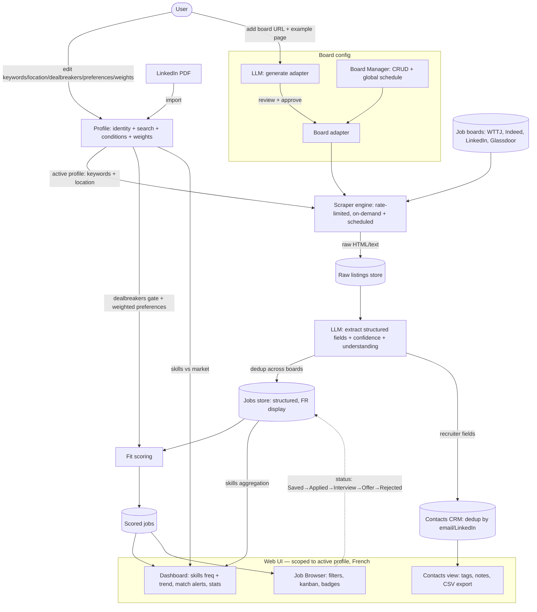

# Job Tendencies — v0 Summary

Single-user job intelligence tool. Pipeline: **scrape job boards → LLM-extract structured data → analyze fit + skill gaps → track applications + recruiter contacts.**

## Dataflow

**Stack:** React (frontend) + Go (backend). LLM for extraction. Architecture TBD with architect agent.
**UI language:** French. **Scope:** single user.

## Core concept: Unified Profile
A Profile merges identity + search + matching conditions. One LinkedIn PDF (one identity) spawns multiple profiles differing only in search target + conditions.
- Profile A: "Go Backend Paris — CDI 65k+"
- Profile B: "Go Backend Remote Europe — Freelance 500€/day"

One profile active at a time, fast switch. Switching re-scopes Dashboard, Job Browser, scraper target.

## Features
| ID | Feature | Slug | One-liner |
|----|---------|------|-----------|
| F1 | Board Manager | `board-manager` | CRUD boards, global schedule, LLM-generated adapters (Option A) |
| F2 | Unified Profiles | `profiles` | identity (LinkedIn PDF) + search + dealbreakers/preferences + fit weights, per profile |
| F3 | LLM Extraction Pipeline | `extraction-pipeline` | raw listing → structured JSON + confidence/understanding scores; raw never translated, fields shown in French |
| F4 | Job Browser | `job-browser` | filter-only browse, kanban Saved→Applied→Interview→Offer→Rejected, dedup, expiry |
| F5 | Dashboard | `dashboard` | skills frequency + trend, match alerts by fit score, stats cards |
| F6 | Contacts CRM | `contacts-crm` | recruiter DB auto-populated, dedup, tags, CSV export |

Each feature spec: `docs/feature/{slug}/feature.md`.

## Cross-cutting
- All job/dashboard views scoped to active profile.
- LLM used twice: adapter generation (board config) + listing extraction (scrape time).
- Confidence/understanding scores per-field + per-listing; badges + filterable thresholds.

## Deferred (not excluded)
Alert delivery beyond dashboard (email/push); multi-user; scraper health monitoring; auto board discovery; skill self-rating; LinkedIn re-import merge strategy.
